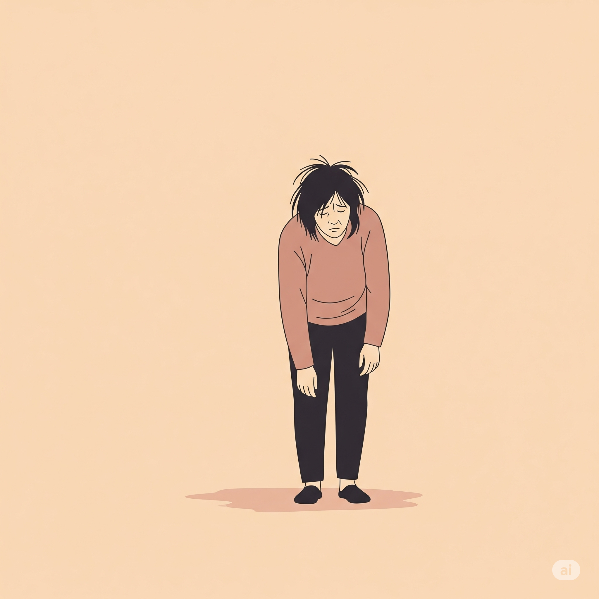

 

Diventare genitori oggi è un'avventura straordinaria, un salto in un amore che non si conosceva prima. Ma è anche, e soprattutto, una prova di resistenza fisica e mentale che la società contemporanea sembra rendere sempre più ardua, demoralizzante e solitaria. Lontani dall'immagine edulcorata che i social media si ostinano a proporre, la realtà dei neogenitori è fatta di notti insonni, pianti inconsolabili (non solo del bambino), e un senso di inadeguatezza che si insinua subdolo tra una poppata e un cambio di pannolino.

E come se non bastasse, a condire questa già complessa ricetta, arrivano puntuali le frasi di circostanza, i consigli non richiesti e i giudizi velati di chi, evidentemente, ha dimenticato cosa significhi avere tra le braccia una vita completamente dipendente da te.

## "Avete voluto la bicicletta? E adesso pedalate."

Questa è forse la frase che più di ogni altra racchiude l'incomprensione e la mancanza di empatia che circonda i neogenitori. Un'affermazione che, con una scrollata di spalle, liquida la fatica, la paura e lo smarrimento, riducendo una delle esperienze più totalizzanti della vita a una semplice scelta di cui ora bisogna, zitti e buoni, subire le conseguenze.

Ma non è l'unica. Il repertorio è vasto e variegato:

* **"Sembra stanca."** Un'ovvietà che suona come un'accusa, come se la stanchezza fosse una colpa e non la naturale conseguenza di un corpo e di una mente costantemente in allerta.
* **"Ai miei tempi non era così."** Un classico intramontabile che invalida le difficoltà attuali, ignorando un contesto sociale ed economico completamente diverso, caratterizzato da maggiore precarietà, assenza di una rete di supporto familiare solida e una pressione sociale asfissiante.
* **"Ma non sei felice? Dovrebbe essere il momento più bello della tua vita."** Questa frase, spesso pronunciata con le migliori intenzioni, può essere una vera e propria pugnalata per una neomamma che sta lottando con le lacrime e un senso di vuoto.
* **"Quando il prossimo?"** Una domanda che denota una totale noncuranza per l'equilibrio precario che la coppia sta cercando di costruire.
* **"Goditelo finché sei in tempo, che poi crescono."** Una frase che, pur partendo da un buon sentimento, mette un'enorme pressione e invalida la fatica del presente in nome di una futura (e ipotetica) nostalgia.
* **"Se ti lamenti adesso, vedrai quando crescerà."** Un modo per sminuire la fatica attuale, proiettando ansia sul futuro invece di offrire supporto per il presente. È una gara alla sofferenza che nessuno ha chiesto di iniziare.

Queste e altre frasi simili, invece di offrire conforto, non fanno che aumentare il senso di isolamento e di inadeguatezza, contribuendo a creare un terreno fertile per un nemico silenzioso e pericoloso: la depressione post partum.

## Il Pericolo Silenzioso: la Depressione Post Partum

È fondamentale parlare apertamente del rischio che una neomamma ha di ammalarsi di depressione post partum. Non si tratta di semplice "baby blues", quella transitoria malinconia che colpisce molte donne subito dopo il parto. La depressione post partum è una patologia vera e propria, che in Italia colpisce circa 1 donna su 10.

I sintomi possono essere vari e non sempre facili da riconoscere:
* Tristezza profonda e persistente
* Pianti frequenti e immotivati
* Perdita di interesse e di piacere nelle attività quotidiane
* Ansia intensa e attacchi di panico
* Sensi di colpa e di inadeguatezza
* Difficoltà di concentrazione
* Disturbi del sonno e dell'appetito
* Pensieri negativi ricorrenti, anche legati alla paura di non essere in grado di accudire il bambino o di fargli del male.

I fattori di rischio sono molteplici: una precedente storia di depressione, la mancanza di supporto da parte del partner e della famiglia, eventi di vita stressanti e, non da ultimo, la pressione sociale a essere una "mamma perfetta". Le frasi sminuenti e i consigli non richiesti possono agire come detonatori, aggravando una situazione di vulnerabilità.

## Chiedere Aiuto è un Atto di Forza, non di Debolezza

La depressione post partum si può e si deve curare e per farlo bisogna sapere da che parte iniziare, quindi la domanda che a questo punto vi starete facendo sarà:

**A chi rivolgersi in Italia?**

* **Consultori Familiari:** Presenti su tutto il territorio nazionale, offrono supporto psicologico e ginecologico.
* **Centri di Salute Mentale (CSM):** Forniscono assistenza psichiatrica e psicoterapeutica.
* **Associazioni di supporto:** Esistono numerose associazioni, come "[CiaoLapo Onlus](https://www.fondazione.ciaolapo.it/)","[Onda - Osservatorio nazionale sulla salute della donna e di genere](https://fondazioneonda.it/it/chi-siamo/onda-osservatorio/)" o [La Leche League Italia](https://www.lllitalia.org/) che offrono informazioni, gruppi di auto-mutuo aiuto e sportelli di ascolto.
* **Psicologi e psicoterapeuti specializzati in psicologia perinatale.**

Crescere un figlio oggi è una sfida immensa. È un atto di coraggio e di amore che merita rispetto, comprensione e sostegno. A tutti i neogenitori che si sentono sopraffatti, demoralizzati e soli: i vostri sentimenti sono validi. Non abbiate paura di chiedere aiuto. Pedalare da soli è difficile, ma insieme si può arrivare lontano.
