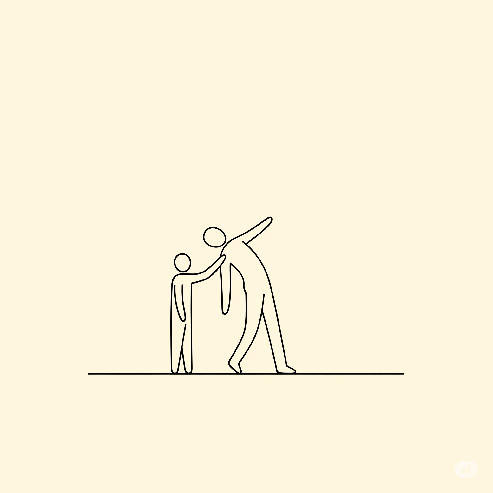

 

Se ti sei mai sentito l'adulto nella stanza mentre parlavi con tua madre o tuo padre, prego, accomodati. Se hai dovuto fare da terapista, consulente finanziario e agenda vivente per la persona che, in teoria, avrebbe dovuto insegnarti ad allacciarti le scarpe, allora sei nel posto giusto. Benvenuto nel club esclusivo, e non troppo divertente, dei figli cresciuti da genitori emotivamente adolescenti. È un'esperienza unica, non trovi? Quella sensazione costante di camminare sulle uova, quel talento innato nel disinnescare una crisi di nervi per un calzino spaiato, quella capacità di offrire supporto emotivo a chi, per legge di natura, dovrebbe offrirlo a te. Ci si sente un po' come un equilibrista senza rete, con la differenza che il leone da domare è l'umore instabile di chi ti ha messo al mondo. E tu, ovviamente, sei diventato bravissimo a non cadere. Complimenti. Il trauma ti ha reso competente.

Spesso, infatti, questa immaturità non è solo una questione di "spirito giovanile", ma nasconde tratti ben più complessi. A volte si manifesta come puro **egocentrismo**: il suo mondo è un palcoscenico e tu sei, nella migliore delle ipotesi, un accessorio di scena. I tuoi successi sono i suoi, i tuoi problemi un fastidioso rumore di fondo. Si impara così a rendersi invisibili per non "disturbare". Altre volte, l'immaturità sconfina nel **narcisismo**, che aggiunge un tocco di manipolazione in più. Qui non esisti come individuo, ma come estensione del suo ego, un trofeo da esibire o un capro espiatorio su cui scaricare ogni colpa. L'amore diventa condizionato, da guadagnare rispettando il proprio ruolo, e il risultato è un'eterna fame di approvazione. E poi c'è il genitore **emotivamente instabile**, che ti costringe a vivere su montagne russe emotive senza cintura di sicurezza, passando dall'euforia alla cupezza in un attimo e trascinando tutti nel suo vortice. Con lui, si diventa iper-vigili, ansiosi, maestri nel gestire la crisi imminente.

Eppure, mentre navighi in questo mare di complessità emotiva, prova ad aggrapparti a un'ironica, misera consolazione: poteva andarti peggio. Potevano essere *due*. Immagina il caos. Invece no, tu hai pescato la versione *light*. Hai solo un genitore che ti scambia per il suo migliore amico, il suo confessore e, occasionalmente, il suo bancomat. Un vero affare, no?

Battute a parte, il vero problema di crescere in questo modo è che ci insegna un modello di amore e di relazione completamente disfunzionale. Impariamo che amare significa annullarsi, che i nostri bisogni sono secondari e che l'affetto va sempre "guadagnato". La ferita più profonda che ci portiamo dentro è la solitudine emotiva e la strisciante convinzione di non essere degni di un amore incondizionato. Per questo, la consapevolezza del meccanismo è il primo, gigantesco passo per spezzare la catena. Riconoscere che non era compito nostro "salvare" i nostri genitori ci permette finalmente di iniziare a salvare noi stessi, costruendo relazioni sane e imparando a mettere i nostri bisogni al primo posto, forse per la prima volta.

E giusto per chiudere con la leggerezza che, a noi, è sempre toccato creare: Essere figli di genitori immaturi è un po' come fare l'escape room: passi la vita a cercare di uscire da una stanza piena di problemi che non hai creato tu.
