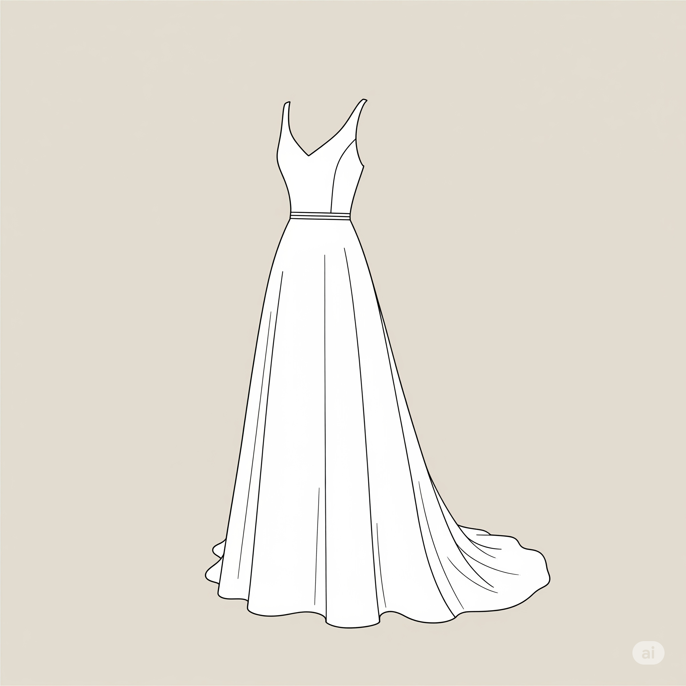

Ah, l'abito da sposa. Quella singolare reliquia di tulle, pizzo e sogni infranti (i miei, non i suoi, sia chiaro) che una volta all'anno mi ricorda perché ho scelto di non fare il commesso in una boutique di alta moda. Oggi, cari lettori maschi – quelli che non sono ancora fuggiti nelle Ande per evitare l'inevitabile – vi porto nel cuore pulsante dell'esperienza, nel sancta sanctorum del bianco e dell'indecisione: la prova dell'abito da sposa.

Si inizia sempre con l'ottimismo. Un ottimismo ingenuo, quasi infantile, come quello di chi crede che il lunedì possa essere un giorno produttivo. Lei, radiosa, con gli occhi che brillano più dei lustrini su un vestito da ballo di Carnevale, mi trascina dentro questo tempio dell'eleganza con la promessa di "solo pochi abiti, amore, giusto per farmi un'idea". E io, beota, annuisco, pensando che magari, con un po' di fortuna, potremmo essere fuori in tempo per una birra fresca.

La realtà, ovviamente, è un colpo nello stomaco più forte di quello che ti dà il conto del fiorista. I "pochi abiti" si trasformano in un'infinita sfilata di tessuti, tagli e sfumature di bianco che, a quanto pare, vanno dal "bianco ottico" al "bianco crema", passando per il "bianco perla" e il "bianco che-se-lo-vedi-alle-dieci-di-sera-sembra-grigio". E il mio ruolo? Il mio ruolo, amici, è quello del **critico d'arte muto**. Posso annuire. Posso sorridere. Posso persino osare un "carino" se mi sento particolarmente coraggioso. Ma guai a me se provo a esprimere un'opinione che non sia già stata preventivamente validata dal suo sguardo interrogativo.

"Questo mi ingrossa?" mi chiede, girando su se stessa con una maestosità che nemmeno una regina a cavallo di un elefante addestrato. E io, con il sudore che mi cola sulla schiena e la mente che elabora algoritmi complessi per trovare la risposta meno offensiva, balbetto qualcosa sul "cascata meglio sul davanti, forse?". Traduzione: "No, amore, non ti ingrossa. Sei tu che mangi troppo tiramisù." Ma questo, ovviamente, lo tengo per me, sepolto sotto strati di auto-conservazione.

Poi c'è il momento del "ma non trovi che questo sia troppo... io?". E qui si apre un abisso filosofico. Cosa significa essere "troppo" lei? È troppo sfarzoso? Troppo semplice? Troppo bianco per un matrimonio in cui il tema è il grigio industriale e il beige sbiadito? Non lo saprò mai. Il mio cervello, a questo punto, è in modalità standby, con l'unica funzione attiva che cerca disperatamente la caffetteria più vicina per una dose massiccia di caffeina e, forse, un gin tonic (sì, lo so, è presto, ma la disperazione non ha orari).

E dopo ore, che sembrano ere geologiche, di "questo sì, questo no, fammelo rivedere quello di prima, aspetta, ho visto qualcosa di simile in quella rivista...", finalmente arriva. L'abito. Quello che, con un colpo di scena degno di Hollywood, lei dice di voler provare "solo per curiosità". E, naturalmente, è quello. Quello che le sta perfettamente, quello che la fa sentire una principessa, quello che ti farà pagare un mutuo trentennale ma che, in fondo, la rende felice.

E mentre la guardo, avvolta in quel tripudio di tessuti e aspettative, un sorriso stanco ma sincero mi si dipinge in volto. Perché sì, è stata una tortura. Sì, ho desiderato ardentemente la morte di un paio di commesse troppo zelanti. Ma vederla così, con gli occhi lucidi e quel sorriso estasiato, fa passare tutto in secondo piano. O quasi. E mentre ci avviamo verso l'uscita, con la sua voce che già progetta scarpe, veli e accessori coordinati, il mio unico pensiero è: "Ok, adesso dove posso trovare un bar con un buon whisky single malt?". La guerra è finita, ma la battaglia dei preparativi è appena cominciata. E io, con il mio spirito da soldato rassegnato, sono pronto a combattere. O, più probabilmente, a sedermi e annuire.

Eppure, tra un sospiro e un'occhiata furtiva all'orologio, c'è stato un momento, o forse più di uno, in cui ho capito che ogni singolo minuto trascorso lì, in quel limbo di pizzi e specchi, valeva la pena. Vedere la gioia nei suoi occhi, l'emozione pura che le illuminava il viso mentre si guardava in quello che sarebbe stato il suo abito, è un'immagine che non dimenticherò mai. È stato un piccolo, prezioso tassello nella costruzione del nostro futuro insieme, un ricordo che porterò sempre nel cuore, anche se la prossima volta, forse, chiederò di aspettare fuori con un buon libro.